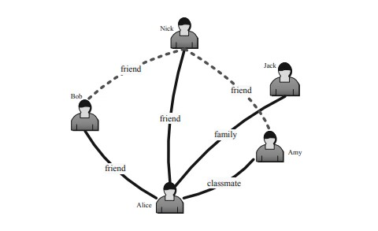
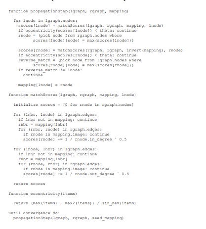
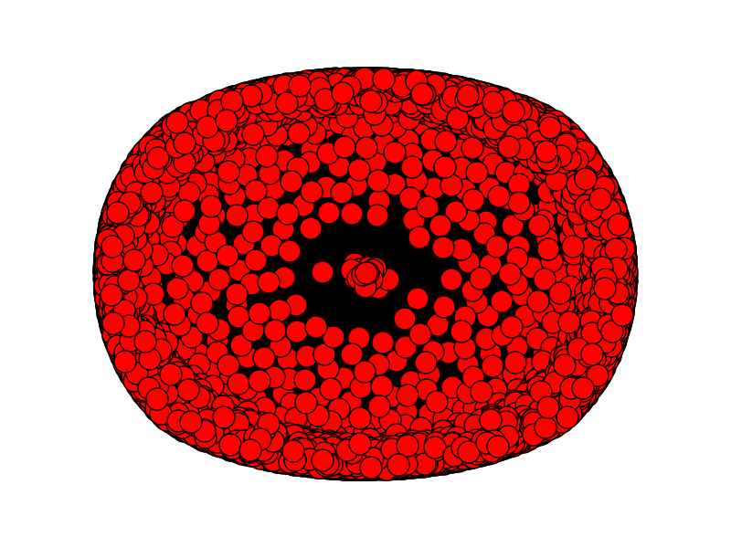

# Midterm Report

小组成员
PB20111704 张宇昂
PB20111647 鲍润晖
PB20000103 王炳勋
PB20111651 何泽昊

## Abstract
在中期阶段，我们针对社交网络反匿名化的seeded方法和seedless方法，通过对它们进行调研、复现，并在数据集上进行测试，取得了初步了成果。本文介绍了小组取得的进步，您解决的挑战和下一步的工作计划。

## Progress
目前为止复现了 Proposal 阶段的两篇论文的算法，它们分别是seeded的论文De-anonymizing social networks，以及seedless的论文Fast De-anonymization of Social Networks with Structural Information
### De-anonymizing Social Networks 分析与复现

### 算法分析

本文是社交网络反匿名化领域的开创性工作，提出了一种通用的匿名社交网络重识别算法。该算法只使用社交网络的结构信息，不对不同网络中成员之间的重叠作出任何先验假设，能够有效地实现匿名社交网络的反匿名化。[1]

具体而言，该算法包括以下几个步骤：

1. 数据预处理：通过少量用户的详细信息以及网络爬虫等方法，获取社交网络中大量的用户和关系数据。

2. 社交网络建模：将社交网络建模为一个包含用户与用户间关系信息的图。同时，构建匿名目标图和攻击者辅助图，为后续节点识别做准备。

   

3. 节点识别：通过**种子查找算法**，识别出匿名目标图和攻击者辅助图中同时存在的少量种子节点，并将它们相互映射。然后，根据种子节点之间的共同邻居和节点度数等信息，将匿名目标图中的节点映射到攻击者辅助图相应的节点。

4. 社交网络重构：利用节点映射关系，不断找出新的映射关系，并加入到原有的关系中，从而实现匿名社交网络的反匿名化。

在这个方法中，最核心的部分就是**种子查找算法**：

该算法分为两个阶段。首先，攻击者鉴别出一小部分“种子”节点，这些节点既存在于匿名目标图中，也存在于攻击者的辅助图中，并将它们相互映射。主要的传播阶段是一个自我加强的过程，使用网络的拓扑结构将种子映射扩展到新节点，并将新的映射反馈给算法。最终的结果是辅助网络和目标网络的子图之间的一个大映射，重新识别了后者中所有映射过的节点。

种子查找算法的输入包括：（1）目标图，（2）k个辅助图中的种子节点，（3）k个节点度值，（4）k个公共邻居计数对，以及（5）误差参数$\theta$。算法在目标图中搜索一个独特的k个节点的完全图，其节点度和公共邻居计数在$1±\theta$的因子范围内匹配。如果找到，则算法将完全图中的节点映射到辅助图中相应的节点；否则，报告失败。

除此之外，算法还需要目标图和辅助图之间的部分“种子”映射$\mu_S$。它输出一个映射$\mu$。可以考虑概率映射，但我们发现将注意力集中在确定性的一一映射$\mu :V_1→V_2$上更简单。直观地，该算法使用网络的拓扑结构和先前构建的映射的反馈来寻找新的映射。它对轻微的拓扑结构修改具有鲁棒性，例如由数据脱敏引入的修改。在每次迭代中，算法从$V_1$和$V_2$之间的累积映射对列表开始。它选择一个未映射的任意节点$u$在$V_1$中，并为$V_2$中的每个未映射节点$v$计算一个分数，该分数等于已映射到$v$的邻居中与$u$相邻的节点数。如果匹配的强度超过阈值$\theta$，则将u和v之间的映射添加到列表中，下一次迭代开始。

还有一些额外的细节和启发式方法需要阐明：

1. Eccentricity：Eccentricity是一种启发式方法，在去匿名化数据库的上下文中使用。它衡量了集合$X$中的一个项目与其他项目之间的差异程度，其中$max$和$max_2$分别表示最高值和第二高值，$σ$表示标准差。我们的算法测量了映射得分集合的离心率（即$v_1$中的单个节点与$v_2$中每个未映射节点之间的映射分数），并且如果离心率得分低于阈值$\theta$，则拒绝该匹配。
   $$
   Eccentricity = \frac{max(X) - max_2(X)}{\delta(X)}
   $$
   
2. Edge directionality：为了计算节点对u和v之间的映射得分，算法计算了两个得分——第一个得分仅基于u和v的入边，第二个得分仅基于出边。然后将这些得分相加。

3. 节点度数：如上所述的映射得分有利于具有高度度数的节点。为了补偿这种偏差，每个节点的得分都除以其度数的平方根。与余弦相似度的原理相同。

4. 重新访问节点：在算法的早期阶段，需要处理的映射较少，因此算法会产生更多的错误。随着算法的进行，映射节点的数量增加，错误率降低。因此需要重新访问已映射的节点：重新访问节点时计算的映射可能会不同，因为有新的映射可用。

5. 反向匹配：该算法对两个图的语义完全不关心。$G_1$是目标图，$G_2$是辅助图，还是反过来都无所谓。每次节点$u$映射到$v$时，都会使用交换输入图的映射得分进行计算。如果$v$映射回$u$，则保留映射；否则，拒绝映射。

6. 复杂度：忽略重新访问节点和反向匹配，该算法的复杂度为$O(|E_1|d_2)$，其中$d_2$是$V_2$中节点度数的上界。

通过2，3的描述可以看出该算法在计算score时采用的余弦相似度作为度量：
$$
cos(X,Y) = \frac{|X \cap Y|}{\sqrt{|X||Y|}}
$$
下图给出了算法的流程的伪代码：



### 复现关键代码

1. Eccentricity计算：直接按照定义实现

   ```python
   def eccentricity(items):
       if all(v == 0 for v in items):
           return 0
       else:
           return (max(items) - max_sec(items)) / numpy.std(items)
   ```

2. 节点匹配的score计算：直接穷举节点对并根据边集合以及余弦相似度计算matchscore：

   ```python
   def matchScores (lgraph, rgraph, mapping, lnode):
       c = nx.nodes(rgraph)
       c.append([0])
       scores = [0 for rnode in c]
   
       a = lnode
   
       for (lnbr, lnode_) in nx.edges(lgraph):
   
           if lnode_ == a:
   
               if lnbr not in mapping: continue
               rnbr = mapping[lnbr]
               b = rnbr
               for (rnbr_, rnode) in nx.edges(rgraph):
                   if rnbr_ == b:
                       if rnode in mapping: continue
                       scores[rnode] += 1 / rgraph.in_degree(rnode) ** 0.5
   
       for (lnode_, lnbr) in nx.edges(lgraph):
   
           if lnode_ == a:
   
               if lnbr not in mapping: continue
               rnbr = mapping[lnbr]
   
               b = rnbr
               for (rnode,rnbr_) in nx.edges(rgraph):
                   if rnbr_ == b:
                       if rnode in mapping: continue
                       scores[rnode] += 1 / rgraph.out_degree(rnode) ** 0.5
   
       return scores
   ```

3. 种子算法迭代得出最终映射的过程：

   ```python
   def matchScores (lgraph, rgraph, mapping, lnode):
       c = nx.nodes(rgraph)
       c.append([0])
       scores = [0 for rnode in c]
   
       a = lnode
   
       for (lnbr, lnode_) in nx.edges(lgraph):
   
           if lnode_ == a:
   
               if lnbr not in mapping: continue
               rnbr = mapping[lnbr]
               b = rnbr
               for (rnbr_, rnode) in nx.edges(rgraph):
                   if rnbr_ == b:
                       if rnode in mapping: continue
                       scores[rnode] += 1 / rgraph.in_degree(rnode) ** 0.5
   
       for (lnode_, lnbr) in nx.edges(lgraph):
   
           if lnode_ == a:
   
               if lnbr not in mapping: continue
               rnbr = mapping[lnbr]
   
               b = rnbr
               for (rnode,rnbr_) in nx.edges(rgraph):
                   if rnbr_ == b:
                       if rnode in mapping: continue
                       scores[rnode] += 1 / rgraph.out_degree(rnode) ** 0.5
   
       return scores
   ```

4. 寻找k个节点的完全子图：

   ```python
   def find_k_clique_seed(lgraph, rgraph, k, e):
   	'''
   	notes: __find_k_cliques is a method that compute the k cliques in left/right sub map
   		   __calc_node_cnc is a method that compute the number of common neighbours
   	'''
       lgraph_k_clqs = __find_k_cliques(lgraph, k)
       rgraph_k_clqs = __find_k_cliques(rgraph, k)
   
       lgraph_undirected = lgraph.to_undirected()
       rgraph_undirected = rgraph.to_undirected()
   
       ## mapping from lgraph to rgraph
       seed_mapping = dict()
       seed_mappings = []
   
       if lgraph_k_clqs is not None and rgraph_k_clqs is not None:
           for lgraph_k_clq in lgraph_k_clqs:
               for rgraph_k_clq in rgraph_k_clqs:
                   for lnode in lgraph_k_clq:
                       for rnode in rgraph_k_clq:
                           lnode_cnc = __calc_node_cnc(lgraph_undirected, lnode, lgraph_k_clq)
                           rnode_cnc = __calc_node_cnc(rgraph_undirected, rnode, rgraph_k_clq)
                           lnode_degree = float(lgraph.degree(lnode))
                           rnode_degree = float(rgraph.degree(rnode))
   
   
                           if (1-e <= (lnode_cnc/rnode_cnc) <= 1+e) and \
                               (1-e <= (lnode_degree/rnode_degree) <= 1+e):
                               seed_mapping[lnode] = rnode
   
                   if len(seed_mapping) == k:
                       seed_mappings.append(copy.copy(seed_mapping))
                       "seed_mapping.clear()"
                       rgraph_k_clqs.remove(rgraph_k_clq)
                       lgraph_k_clqs.remove(lgraph_k_clq)
                       break
   
           return seed_mapping
   
       else:
           print ('No k-cliques have been found')
   ```

### 结果 & 总结



将数据集转化成拓扑图如上(由于节点太多导致无法清晰表达出拓扑结构)，结果与论文中得到的结果相同，有30%的正确识别率，但是算法的复杂度仍然过高，运行时间**难以想象地长**，这是因为边数和结点个数都过多，而算法的迭代方法也是朴素的暴力迭代，我们相信算法效率的提高和正确率的提高是拓展算法最重要的两个组成部分


### Fast De-anonymization of Social Networks with Structural Information 分析与复现

这篇论文使用一种快速无种子去匿名化算法RoleMatch，它仅根据结构信息对网络进行去匿名化处理，并且提出了一系列相似性度量（如RoleSim++）。在节点匹配阶段，除了节点相似性度外，还可以使用领域信息来提高匹配准确度

#### 模型介绍

* 去匿名化问题
    给定一个总原始网络G，我们可以获得它的两个部分：
    * G1是攻击者从G爬取的子网络，节点仅包含可以被爬取到的公共信息（如下图中的名字）
    * G2是一个被机构披露出的匿名网络，节点仅包含被披露的信息（如下图中的位置），而不包括公共信息
    * G2可能未必是G的子图，因为披露时可能对图进行了扰动（修改了部分边等等）
    * G1和G2之间会有部分重合：假设存在子网Gc⊂G1和G′c⊂G2，这样Gc.V=G′c.V，Gc表示爬网和匿名网络之间的重叠，称为重叠网络。那么去匿名化过程就是匹配Gc和G′c之间节点尽可能多的过程


* 噪音
  网络中不重叠的部分大小被称为噪音
  引入重叠率λ=|Vc||V1∪V2|，那么，噪声比为1−λ

*  去匿名化问题的分类
   *  |G1|≈|G2|时称为全局匿名化，此时去匿名化比较容易
   *  |G1|≪|G2|时称为局部匿名化，此时攻击者的目标只是去匿名化特定部分节点

#### 算法分析

* RoleMatch
  这是本文实现的去匿名化算法，输入两个网络G1和G2，输出匹配的节点
  * 根据结构信息，计算G1和G2所有节点对之间的相似度
    * 这个相似度计算可以由RoleSim++或者α-RoleSim++等度量实现
    * 值得一提的是，这个相似度计算过程是seedless的，但是它也可以接受种子匹配信息
  * 根据相似度得分调用findNodeMatch生成最终节点匹配映射
    * findNodeMatch中调用了NeighborMatch算法，综合相似度和邻域信息得到匹配

* NeighborMatch
  NeighborMatch基于两个观察结果：首先，正确的映射往往具有更高的相似性分数，其次，如果一对节
  点的邻居是正确的映射，则它们更有可能成为正确的映射
  * 开始时NeighborMatch使用相似性得分最高的一对作为种子
  * 然后，重复匹配匹配邻居数高于阈值 r 的节点对，直到不再有至少匹配 r 个邻居的不匹配对

* RoleSim++度量
  对于两个点u∈G1，u∈G1，我们用$N^{out}_1(u)$，$N^{in}_1(u)$表示u的出边邻居集合和入边邻居集合，同理有$N^{out}_2(v)$，$N^{in}_2(v)$
  下面定义u和v之间的最大出入度数
  $
  \Delta^{out}(u,v)=max{|N^{out}_1(u)|,|N^{out}_2(v)|}
  $
  $
  \Delta^{in}(u,v)=max{|N^{in}_1(u)|,|N^{in}_2(v)|}
  $
  再定义$N^{out}_1(u)$和$N^{out}_2(v)$之间的匹配$M^{out}(u,v)$，$N^{in}_1(u)$和$N^{in}_2(v)$之间的匹配$M^{in}(u,v)$
  就可以定义$N_1(u)$和$N_2(v)$之间所有可能匹配的最大出边/入边相似性得分
  $
  \Gamma^{out}(u,v)=max_{\{M^{out}(u,v)\}}\sum_{(x,y)∈M^{out}(u,v)}Sim(x,y)
  $
  $
  \Gamma^{in}(u,v)=max_{\{M^{in}(u,v)\}}\sum_{(x,y)∈M^{in}(u,v)}Sim(x,y)
  $
  其中Sim(x,y)是点x和y的相似性
  最终可以定义RoleSim++：
  $$
  Sim(u,v)=(1-\beta)\frac{\Gamma^{out}(u,v)+\Gamma^{in}(u,v)}{\Delta^{out}(u,v)+\Delta^{in}(u,v)}+\beta
  $$
  其中$\beta$是一个0到1的系数


#### 算法复现

* 算法总流程
  ```cpp
  int main(int argv, char *argc[]) {
      assert(argv == 5);
      algo_iter ai = (algo_iter) atoi(argc[1]);
      algo_match am = (algo_match) atoi(argc[2]);
      int do_interm = atoi(argc[3]);
      int overlap = atoi(argc[4]);
      PreprocessGraph(ai, am);
      CalcSimilarity(ai);
      MatchGraph(am, overlap);
      
      return 0;
  }
  ```
  先后调用```PreprocessGraph```读入图信息，```CalcSimilarity```计算相似性，```MatchGraph```进行匹配

* 计算相似性，以RoleSim++相似性度量为例，使用迭代计算
  ```cpp
  void CalcSimilarity(algo_iter ai) {
      switch (ai) {
        ...
           case ROLESIM_PLUS: {
              InitRoleSimPlus();
              for (int i = 0; i < ITER_NUM; i++) {
                int old = i & 0x1;
                IterateRoleSimPlus(sim_score[old], sim_score[1 - old]);
              }
              break;
            }
        ...
      }
  }
  ```
  反复调用```IterateRoleSimPlus```迭代计算相似性，而其中又主要调用```RoleSimPlusThread```函数

  ```cpp
  static void *RoleSimPlusThread(void *paramIn){
    struct rolesimplus_thread_params *param = (struct rolesimplus_thread_params *)paramIn;
    int id = param->id;
    const SimMat &sim_score = *(param->sim_score);
    SimMat &new_score = *(param->new_score);

    for (int i = id; i <= n1; i += MAX_THREAD){
      for (int j = 1; j <= n2; j++) {
        if (G1[i].size() > 0 && G2[j].size() > 0)
          new_score[i][j] = (MaxMatch(i, j, sim_score, G1, G2)
                          + MaxMatch(i, j, sim_score, RG1, RG2))
                          / (max((double)G1[i].size(), (double)G2[j].size())
                          + max((double)RG1[i].size(), (double)RG2[j].size()))
                          * (1 - BETA) + BETA;
          else
            new_score[i][j] = BETA;
      }
    }
    return NULL;
  }
  ```
可见其中```new_score```的定义和论文中的一样

  
* 进行匹配，以基于RoleSim++相似性度量和领域信息的FEEDBACK为例
  ```cpp
  void MatchGraph(algo_match am, int overlap) {
    switch (am) {
      ...
      case FEEDBACK: {
          Initiate(sim_score[ITER_NUM & 0x1]);
          while (total_cnt < n1) {
            int idx = GetMax();
            if (idx == 0) break;
            assert(idx != 0);
            MatchNode(idx, top[idx], overlap);
            IncreaseNb(idx, top[idx], sim_score[ITER_NUM & 0x1]);
          }
      }
      ...
    }
  }
  ```
  在```while```循环中，```MatchNode```每次尝试匹配最有相似性（且尚未匹配）的节点idx，```IncreaseNb```则考察idx的邻域节点相似性辅助匹配

#### 结果和展望


在本次初步尝试的数据集中，总数据集Gs，有100个点和600多条边，将它分成两个子集G1和G2，它们各自有300多条边，并且重叠的边仅有60多条，重叠的点仅20左右
在此情况下，在设置迭代次数为5，采用RoleSim度量和FEEDBACK匹配方法，得到了2个正确的匹配

考虑到G1和G2的重合部分相当少，所以数据集的噪声很大。在这种情况下还能很快得到正确匹配，也是很不容易的（相较于seeded的方法De-anonymizing Social Networks的运行时间而言）

未来可以构造一些更友好的数据集，并尝试不同的相似性度量和匹配方法，以期有更好的准确性

## Challenges we have addressed
### 数据集的选择
在seedless的De-anonymizing Social Networks论文中，指明了使用的公用的数据集LiveJournal、Twitter、Enron。但是在复现论文算法时，并没有找到相关的数据集设置，仅能靠```PreprocessGraph```读入图数据的函数的格式来推测数据集的形式。

所幸读完相关代码，推测出了数据集的格式。但是在下载公用数据集之后，我们发现LiveJournal、Twitter数据集的格式和本论文代码的差别较大，只有无向图Enron的格式和本论文相符，所以只能先采用Enron数据集。

> 给定一个大型网络 G，我们首先从 G 中随机提取一个子网络作为种子网络，表示为Gs=(Vs,Es)，并使用 中的节点Gs生成已爬网网络G1=(V1,E1)和匿名网络G2=(V2,E2)

我们按照作者在论文中构造图Gs、G1，G2的方法，写了一个在Enron数据集上生成实验数据集的脚本，并且这个数据集能成功复现实验（只不过数据集不是很友好，实验成功率略低）

下一步可以尝试更合理的数据集生成方法。

### 复现论文中的实验结果
我们分别针对社交网络反匿名化的seeded和seedless方法，了解了相关原理，复现了相关代码，并得到了初步的实验结果。

### 对实验结果进行初步分析和比较
两种算法的原理不同，但是都需要进行迭代和调整参数，从我们初步的运行结果看来，正确匹配的比例还不高，无法达到论文里的实验结果，因此，调整迭代次数和参数以达到满意结果是我们后续工作的重要部分。

## The left workloads
1.针对反匿名化算法中涉及的迭代次数和参数，对其进行深入理解和调整，以达到满意的运行时间和精确度。

2.对反匿名化结果进行分析和报告，包括反匿名化准确度、效率、隐私保护措施等方面的评估和总结。

3.探索优化算法的可能，选出综合性能更高的一种方法，阅读相关论文并自己创新，达到对算法进行优化的目的。或者寻找把seeded方法和seedless方法结合的方法，以达到更高的精确度