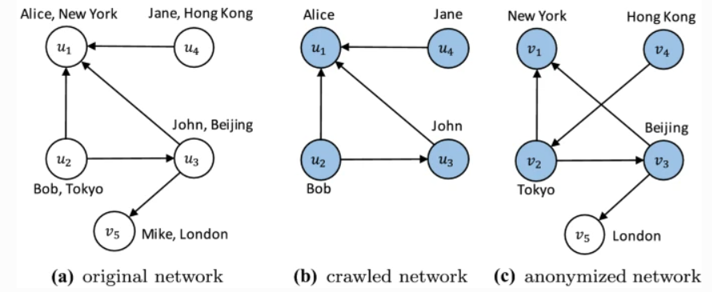

## Progress

目前为止复现了 Proposal 阶段的两篇论文的算法，它们分别是seeded的论文De-anonymizing social networks，以及seedless的论文Fast De-anonymization of Social Networks with Structural Information

### De-anonymizing Social Networks 分析与复现

### Fast De-anonymization of Social Networks with Structural Information 分析与复现

这篇论文使用一种快速无种子去匿名化算法RoleMatch，它仅根据结构信息对网络进行去匿名化处理，并且提出了一系列相似性度量（如RoleSim++）。在节点匹配阶段，除了节点相似性度外，还可以使用领域信息来提高匹配准确度

#### 模型介绍

* 去匿名化问题
    给定一个总原始网络G，我们可以获得它的两个部分：
    * G1是攻击者从G爬取的子网络，节点仅包含可以被爬取到的公共信息（如下图中的名字）
    * G2是一个被机构披露出的匿名网络，节点仅包含被披露的信息（如下图中的位置），而不包括公共信息
    * G2可能未必是G的子图，因为披露时可能对图进行了扰动（修改了部分边等等）
    * G1和G2之间会有部分重合：假设存在子网Gc⊂G1和G′c⊂G2，这样Gc.V=G′c.V，Gc表示爬网和匿名网络之间的重叠，称为重叠网络。那么去匿名化过程就是匹配Gc和G′c之间节点尽可能多的过程



* 噪音
  网络中不重叠的部分大小被称为噪音
  引入重叠率λ=|Vc||V1∪V2|，那么，噪声比为1−λ

*  去匿名化问题的分类
   *  |G1|≈|G2|时称为全局匿名化，此时去匿名化比较容易
   *  |G1|≪|G2|时称为局部匿名化，此时攻击者的目标只是去匿名化特定部分节点

#### 算法分析

* RoleMatch
  这是本文实现的去匿名化算法，输入两个网络G1和G2，输出匹配的节点
  * 根据结构信息，计算G1和G2所有节点对之间的相似度
    * 这个相似度计算可以由RoleSim++或者α-RoleSim++等度量实现
    * 值得一提的是，这个相似度计算过程是seedless的，但是它也可以接受种子匹配信息
  * 根据相似度得分调用findNodeMatch生成最终节点匹配映射
    * findNodeMatch中调用了NeighborMatch算法，综合相似度和邻域信息得到匹配

* NeighborMatch
  NeighborMatch基于两个观察结果：首先，正确的映射往往具有更高的相似性分数，其次，如果一对节
  点的邻居是正确的映射，则它们更有可能成为正确的映射
  * 开始时NeighborMatch使用相似性得分最高的一对作为种子
  * 然后，重复匹配匹配邻居数高于阈值 r 的节点对，直到不再有至少匹配 r 个邻居的不匹配对

* RoleSim++度量
  对于两个点u∈G1，u∈G1，我们用$N^{out}_1(u)$，$N^{in}_1(u)$表示u的出边邻居集合和入边邻居集合，同理有$N^{out}_2(v)$，$N^{in}_2(v)$
  下面定义u和v之间的最大出入度数
  $
  \Delta^{out}(u,v)=max{|N^{out}_1(u)|,|N^{out}_2(v)|}
  $
  $
  \Delta^{in}(u,v)=max{|N^{in}_1(u)|,|N^{in}_2(v)|}
  $
  再定义$N^{out}_1(u)$和$N^{out}_2(v)$之间的匹配$M^{out}(u,v)$，$N^{in}_1(u)$和$N^{in}_2(v)$之间的匹配$M^{in}(u,v)$
  就可以定义$N_1(u)$和$N_2(v)$之间所有可能匹配的最大出边/入边相似性得分
  $
  \Gamma^{out}(u,v)=max_{\{M^{out}(u,v)\}}\sum_{(x,y)∈M^{out}(u,v)}Sim(x,y)
  $
  $
  \Gamma^{in}(u,v)=max_{\{M^{in}(u,v)\}}\sum_{(x,y)∈M^{in}(u,v)}Sim(x,y)
  $
  其中Sim(x,y)是点x和y的相似性
  最终可以定义RoleSim++：
  $$
  Sim(u,v)=(1-\beta)\frac{\Gamma^{out}(u,v)+\Gamma^{in}(u,v)}{\Delta^{out}(u,v)+\Delta^{in}(u,v)}+\beta
  $$
  其中$\beta$是一个0到1的系数


#### 算法复现

* 算法总流程
  ```cpp
  int main(int argv, char *argc[]) {
      assert(argv == 5);
      algo_iter ai = (algo_iter) atoi(argc[1]);
      algo_match am = (algo_match) atoi(argc[2]);
      int do_interm = atoi(argc[3]);
      int overlap = atoi(argc[4]);
      PreprocessGraph(ai, am);
      CalcSimilarity(ai);
      MatchGraph(am, overlap);
      
      return 0;
  }
  ```
  先后调用```PreprocessGraph```读入图信息，```CalcSimilarity```计算相似性，```MatchGraph```进行匹配

* 计算相似性，以RoleSim++相似性度量为例，使用迭代计算
  ```cpp
  void CalcSimilarity(algo_iter ai) {
      switch (ai) {
        ...
           case ROLESIM_PLUS: {
              InitRoleSimPlus();
              for (int i = 0; i < ITER_NUM; i++) {
                int old = i & 0x1;
                IterateRoleSimPlus(sim_score[old], sim_score[1 - old]);
              }
              break;
            }
        ...
      }
  }
  ```
  反复调用```IterateRoleSimPlus```迭代计算相似性，而其中又主要调用```RoleSimPlusThread```函数

  ```cpp
  static void *RoleSimPlusThread(void *paramIn){
    struct rolesimplus_thread_params *param = (struct rolesimplus_thread_params *)paramIn;
    int id = param->id;
    const SimMat &sim_score = *(param->sim_score);
    SimMat &new_score = *(param->new_score);

    for (int i = id; i <= n1; i += MAX_THREAD){
      for (int j = 1; j <= n2; j++) {
        if (G1[i].size() > 0 && G2[j].size() > 0)
          new_score[i][j] = (MaxMatch(i, j, sim_score, G1, G2)
                          + MaxMatch(i, j, sim_score, RG1, RG2))
                          / (max((double)G1[i].size(), (double)G2[j].size())
                          + max((double)RG1[i].size(), (double)RG2[j].size()))
                          * (1 - BETA) + BETA;
          else
            new_score[i][j] = BETA;
      }
    }
    return NULL;
  }
  ```
可见其中```new_score```的定义和论文中的一样

  
* 进行匹配，以基于RoleSim++相似性度量和领域信息的FEEDBACK为例
  ```cpp
  void MatchGraph(algo_match am, int overlap) {
    switch (am) {
      ...
      case FEEDBACK: {
          Initiate(sim_score[ITER_NUM & 0x1]);
          while (total_cnt < n1) {
            int idx = GetMax();
            if (idx == 0) break;
            assert(idx != 0);
            MatchNode(idx, top[idx], overlap);
            IncreaseNb(idx, top[idx], sim_score[ITER_NUM & 0x1]);
          }
      }
      ...
    }
  }
  ```
  在```while```循环中，```MatchNode```每次尝试匹配最有相似性（且尚未匹配）的节点idx，```IncreaseNb```则考察idx的邻域节点相似性辅助匹配

#### 结果和展望


在本次初步尝试的数据集中，总数据集Gs，有100个点和600多条边，将它分成两个子集G1和G2，它们各自有300多条边，并且重叠的边仅有60多条，重叠的点仅20左右
在此情况下，在设置迭代次数为5，采用RoleSim度量和FEEDBACK匹配方法，得到了2个正确的匹配

考虑到G1和G2的重合部分相当少，所以数据集的噪声很大。在这种情况下还能很快得到正确匹配，也是很不容易的（相较于seeded的方法De-anonymizing Social Networks的运行时间而言）

未来可以构造一些更友好的数据集，并尝试不同的相似性度量和匹配方法，以期有更好的准确性

## Addressed challenges

### 构造数据集

在seedless的De-anonymizing Social Networks论文中，指明了使用的公用的数据集LiveJournal、Twitter、Enron。但是在复现论文算法时，并没有找到相关的数据集设置，仅能靠```PreprocessGraph```读入图数据的函数的格式来推测数据集的形式。

所幸读完相关代码，推测出了数据集的格式。但是在下载公用数据集之后，我们发现LiveJournal、Twitter数据集的格式和本论文代码的差别较大，只有无向图Enron的格式和本论文相符，所以只能先采用Enron数据集。

> 给定一个大型网络 G，我们首先从 G 中随机提取一个子网络作为种子网络，表示为Gs=(Vs,Es)，并使用 中的节点Gs生成已爬网网络G1=(V1,E1)和匿名网络G2=(V2,E2)

我们按照作者在论文中构造图Gs、G1，G2的方法，写了一个在Enron数据集上生成实验数据集的脚本，并且这个数据集能成功复现实验（只不过数据集不是很友好，实验成功率略低）

下一步可以尝试更合理的数据集生成方法。
